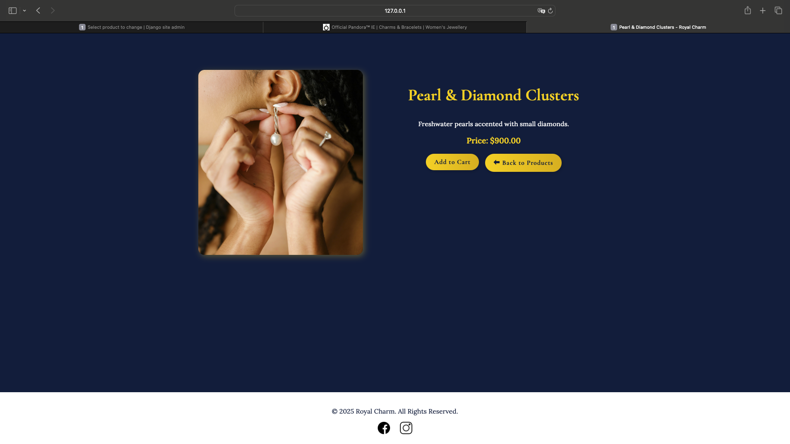
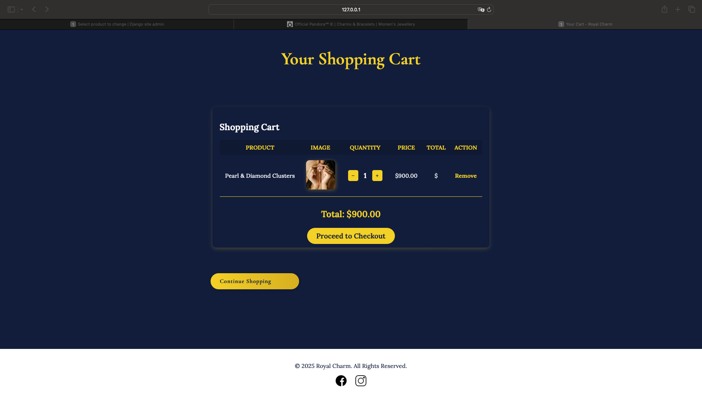
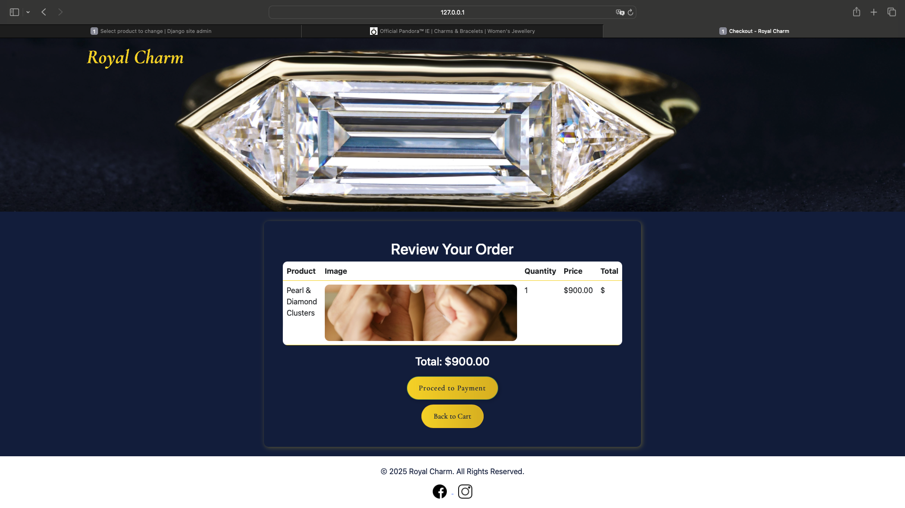

# Royal Charm - Luxury Jewelry Store

### A Django-based eCommerce website for sophisticated, high-end jewelry.

**Royal Charm**  
[Website](https://royalcharm.herokuapp.com/)

---

## 📌 Table of Contents

- [Project Overview](#project-overview)
- [Features](#features)
- [Technologies Used](#technologies-used)
- [Design](#design)
- [User Stories](#user-stories)
- [Known Issues](#known-issues)
- [Deployment To Heroku](#deployment-to-heroku)
- [Credits](#credits)

---

## 🎯 Project Overview

**Royal Charm** is an elegant online jewelry store that allows users to explore and purchase high-end jewelry pieces. It features a seamless shopping experience with a sophisticated navy and gold theme, a fully responsive design, and a secure checkout process using Stripe for payments.

This project was built using **Django** for the backend and **Bootstrap** for a responsive, professional-looking frontend.

---

## 🌟 Features

### **General Features**
- **User Authentication**: Users can register, log in, and log out.
- **Product Listing**: Customers can browse jewelry collections with high-quality images and descriptions.
- **Product Categories**: Jewelry items are categorized into **Necklaces, Bracelets, Earrings, and Rings** for easy navigation.
- **Search Functionality**: A search bar allows users to find specific products by name.

### **Shopping Cart & Checkout**
- **Add to Cart**: Users can add products to their cart and adjust quantities with `+` and `-` buttons.
- **Cart Overview**: Displays product images, names, prices, and a total cost before checkout.
- **Secure Checkout**: Integrated with **Stripe** for payment processing.
- **Order Confirmation**: Users receive a success message after payment is completed.

### **UI & Design**
- **Sophisticated Theme**: Navy blue and gold color scheme for a luxurious look.
- **Responsive Design**: Bootstrap ensures a seamless experience across devices.
- **Elegant Buttons**: Gradient gold buttons with hover effects.
- **Fixed Navbar with Cover Image**: The navbar blends into the background for a refined feel.
- **Footer with Social Media Links**: Includes Facebook and Instagram icons linking to business pages.

### **Additional Features**
- **Custom 404 Page**: Ensures a branded user experience if users land on an incorrect URL.
- **SEO & Performance Enhancements**: Robots.txt, sitemap.xml, and meta tags for better search rankings.

---

## 🔧 Technologies Used

- **Python & Django**: Backend development and database management.
- **HTML5, CSS3, Bootstrap**: Frontend design and layout.
- **JavaScript**: Interactive elements like quantity updates in the shopping cart.
- **Stripe API**: Secure payment processing.
- **PostgreSQL**: Production database on Heroku.
- **Heroku**: Deployment platform for hosting the live website.
- **GitHub**: Version control and agile tracking using Kanban boards.

---

## 🎨 Design & Layout

### **Homepage**
- Features a **hero cover image** with a seamless blend into the background.
- The **navbar is integrated with the cover image**, containing the logo, category buttons, and search bar.
- **Featured products** are displayed in a visually appealing card layout.

### **Product Listing**
- Jewelry items are displayed in a grid format with **uniform image sizes**.
- Clicking a product leads to a **detailed product page** with descriptions and purchasing options.

### **Shopping Cart & Checkout**
- The cart page follows a **refined layout** with clear quantity controls.
- Checkout is secure, and the **payment process is simple and intuitive**.

### **Color Palette**
- **Navy Blue (#0a1f44)** - Background and primary elements.
- **Gold (#FFD700)** - Buttons, highlights, and accents.
- **White (#FFFFFF)** - Text and contrast elements.

### **Typography**
- **Primary Font**: `"Cormorant Garamond", serif` for an elegant and sophisticated feel.
- **Secondary Font**: `"Montserrat", sans-serif` for clean readability.

---

## ✅ User Stories

1. **As a visitor**, I want to browse available jewelry items so I can explore my options.
2. **As a visitor**, I want to search for a specific product so I can find it quickly.
3. **As a visitor**, I want to filter products by category so I can find the type of jewelry I need.
4. **As a customer**, I want to add products to my cart so I can purchase them later.
5. **As a customer**, I want to increase or decrease the quantity of a product in my cart.
6. **As a customer**, I want to remove an item from my cart.
7. **As a customer**, I want to securely enter my payment details and complete my purchase.
8. **As a user**, I want to create an account so I can track my orders.
9. **As a user**, I want to log in and log out of my account for security.
10. **As a user**, I want to return to the homepage by clicking the logo.

---

## 🛠 Known Issues

- **Safari Image Scaling Issues**: Some images do not scale correctly on Safari browsers, requiring additional fixes.
- **Email Notifications**: No email confirmation is sent upon successful registration or purchase.
- **Wishlist Feature Missing**: Currently, users cannot save favorite products for later.

---

## 🚀 Deployment To Heroku 

### **1️⃣ Setup Heroku**
1. Log in to [Heroku](https://www.heroku.com/) and create a new app.
2. Choose a unique name and select the correct region (**UK** or **US**).
3. Link the app to the **GitHub repository**.

### **2️⃣ Configure Environment Variables**
1. Add `SECRET_KEY`, `DEBUG=False`, and `ALLOWED_HOSTS` in **Heroku Config Vars**.
2. Add **Stripe API keys** for secure payment processing.

### **3️⃣ Add Buildpacks & Deploy**
1. **Add Python & Node.js** buildpacks (Python should be first).
2. Enable **automatic deployment** from GitHub.
3. Click **Deploy Branch** to push the project live.

---

## 🔗 External Integrations

- **Stripe**: Secure payment gateway for checkout transactions.
- **Facebook & Instagram**: Social media icons in the footer link to business pages.
- **Heroku**: Cloud hosting for seamless deployment.

---

## 🙌 Credits

I would like to express my gratitude to **Code Institute** for their structured Full Stack Developer course. 

A huge thanks to my **mentor** Precious for guiding me through the development process.

Thank you to the **Code Institute Support Team** for their encouragement and guidance throughout the project.

---
